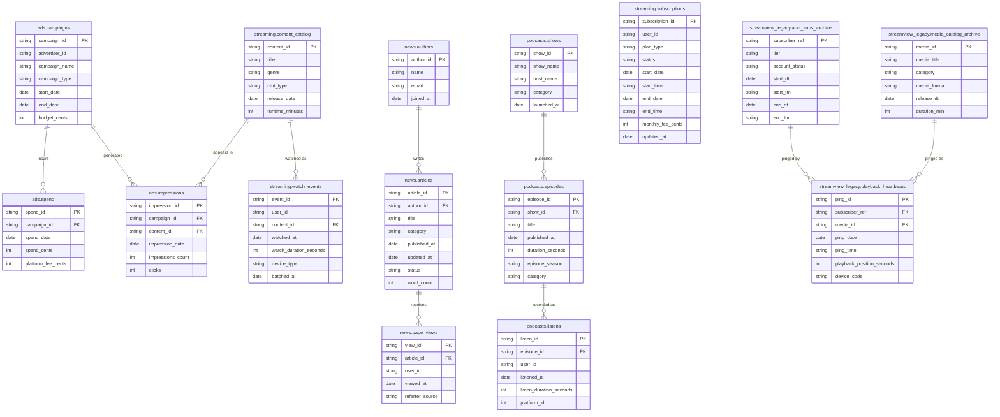

# Data Model

This page documents the raw data model across the platform's source domains: **Ads**, **News**, **Podcasts**, **Streaming**, and **Streamview Legacy** - the archived data from StreamView, the platform MediaPulse migrated off of. Streamview Legacy is owned by `mediapulse_analytics`, not `mediapulse_base` - included here for the full picture, not because both projects read from it.

## Entity Relationship Diagram

Want to zoom in? [Visit the full ERD here.](https://mermaid.ai/d/e241c203-3583-4e1e-9b21-7bd413a74c00)

## Domains

### Ads
| Table | Description |
|---|---|
| `ads.campaigns` | Advertiser campaigns with budget and date range |
| `ads.impressions` | Impressions and clicks per campaign and content item |
| `ads.spend` | Daily spend and platform fees per campaign |

### News
| Table | Description |
|---|---|
| `news.authors` | Author profiles |
| `news.articles` | Articles with author, category, and status |
| `news.page_views` | Page view events per article and user |

### Podcasts
| Table | Description |
|---|---|
| `podcasts.shows` | Podcast show metadata |
| `podcasts.episodes` | Episodes with season, category, and duration |
| `podcasts.listens` | Listen events per episode and user, with a numeric `platform_id` |

### Streaming
| Table | Description |
|---|---|
| `streaming.content_catalog` | Video content with genre and runtime |
| `streaming.subscriptions` | User subscription plans and status |
| `streaming.watch_events` | Watch events per content item and user |

### Streamview Legacy
| Table | Description |
|---|---|
| `streamview_legacy.media_catalog_archive` | Legacy content catalog, some items re-catalogued under a new `content_id` |
| `streamview_legacy.acct_subs_archive` | Legacy subscriber accounts, some migrated to a new `user_id` |
| `streamview_legacy.playback_heartbeats` | Playback heartbeat pings, roughly one per minute of playback (not one row per completed watch, unlike `streaming.watch_events`) |

## Cross-domain Relationships

`ads.impressions` links to `streaming.content_catalog` via `content_id`, meaning ad impressions are served against streaming content items.

!!! note "Streamview Legacy migration"
    `streamview_legacy` has no direct FK into `streaming` - the two are reconciled through a separate mapping seed (`map_streaming_legacy_fields`) that isn't raw source data, so it isn't drawn here. Not every legacy subscriber or content item has been migrated yet.

!!! note "Users"
    `user_id` appears in `news.page_views`, `podcasts.listens`, `streaming.subscriptions`, and `streaming.watch_events` but there is no `users` table in the raw data. A unified users table may exist upstream.
